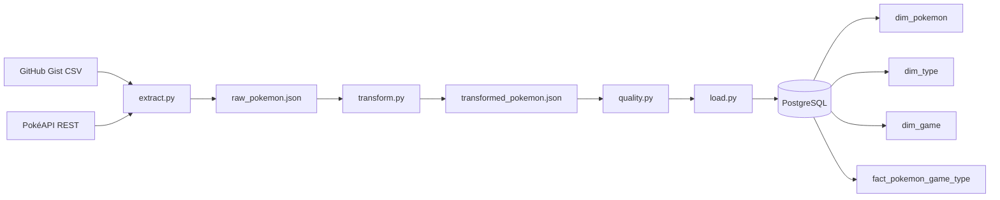

# 🐉 PokeAndre — ETL Pipeline & Data Warehouse

Este projeto é um pipeline de Engenharia de Dados (ETL) end-to-end desenvolvido para extrair dados da **PokéAPI**, transformá-los de acordo com regras de negócio, garantir a integridade dos dados e carregá-los em um **Data Warehouse** no PostgreSQL, modelado no formato **Star Schema**. 

Todo o fluxo é orquestrado pelo **Apache Airflow** e containerizado com **Docker**.

---

## 🎯 Arquitetura do Projeto

O projeto segue uma arquitetura modular, onde cada etapa do pipeline ETL possui uma responsabilidade única e isolada:



1. **Extract (`extract.py`):** Coleta IDs de um CSV (GitHub Gist) e faz chamadas HTTP (REST) individuais à PokéAPI para extrair os dados JSON brutos.
2. **Transform (`transform.py`):** Aplica regras de negócio em memória (via Python nativo/dicionários).
3. **Quality (`quality.py`):** Atua como um *Gatekeeper*, validando integridade e regras estritas antes de permitir a persistência no banco.
4. **Load (`load.py` & `models.py`):** Persiste os dados de forma *idempotente* no PostgreSQL usando SQLAlchemy (Declarative Base).
5. **Orquestração (`dags/pokeandre_dag.py`):** Define o fluxo de execução sequencial (`Extract >> Transform >> Quality >> Load`) usando o Apache Airflow.

---

## 🛠️ Tecnologias Utilizadas

- **Linguagem:** Python 3.10
- **Banco de Dados:** PostgreSQL 15
- **Orquestração:** Apache Airflow 2.9
- **ORM / Conexão DB:** SQLAlchemy 2.0 / psycopg2
- **Infraestrutura:** Docker e Docker Compose
- **Integração / API:** `requests`

---

## 📊 Modelagem de Dados (Star Schema)

Os dados no PostgreSQL foram modelados pensando em consultas analíticas (OLAP). Utilizamos uma Tabela Fato centralizada e três Tabelas Dimensionais:

* **Tabelas Dimensionais:**
  * `dim_pokemon` (IDs e Nomes)
  * `dim_type` (Tipos como *fire*, *water*, *grass*)
  * `dim_game` (Versões de jogos como *red*, *blue*)
* **Tabela Fato (`fact_pokemon_game_type`):** 
  * Relaciona cada Pokémon aos seus Tipos e aos 2 primeiros Jogos em que apareceu.
  * Possui Chave Primária Composta (`pokemon_id`, `type_id`, `game_id`) baseada em Foreign Keys para as dimensões.

---

## 🚀 Roteiro Explicativo para o Vídeo

*Aqui está um resumo passo a passo de como o código foi construído, ideal para guiar a sua explicação no vídeo:*

### 1. Estrutura do Projeto (`src/etl`)
**Explicação:** O projeto não é um grande script monolítico. Separamos a lógica em módulos dentro de `src/etl/` e mantivemos as variáveis de ambiente centralizadas no `config.py` (padrão Singleton), para podermos configurar, por exemplo, limites de requisição (`POKEMON_LIMIT`) no ambiente de desenvolvimento sem afetar a produção.

### 2. A Extração de Dados (`extract.py`)
**Explicação:** Implementamos um fluxo que lê dados de duas fontes heterogêneas (atendendo ao Requisito 1). Primeiro, fazemos o download de um arquivo CSV de um GitHub Gist utilizando a biblioteca `wget` para obter uma lista de IDs de Pokémons. Depois, iteramos sobre essa lista e realizamos chamadas REST individuais e específicas à PokéAPI para cada ID de Pokémon, consolidando os resultados em um único arquivo JSON.

### 3. A Transformação (`transform.py`)
**Explicação:** O coração da regra de negócio. Aqui nós pegamos o JSON bruto e aplicamos 6 regras:
- Extração de Tipos complexos em listas limpas.
- Limite de aparição: filtramos para salvar apenas os **2 primeiros jogos** em que o Pokémon apareceu.
- Modelagem Relacional em Memória: dividimos um grande JSON hierárquico em 4 listas bidimensionais separadas (`dim_pokemon`, `dim_type`, `dim_game` e a `fato`), simulando tabelas do banco.

### 4. Garantia de Qualidade (`quality.py`)
**Explicação:** Antes de salvar qualquer coisa, o script de "Quality" roda testes de estresse nos dados. Ele garante que não existam IDs nulos, que não existam nomes vazios, valida a falta de duplicatas e, o mais importante, testa a **Integridade Referencial**. Se a tabela fato tentar referenciar um ID de jogo que não existe na `dim_game`, o script paralisa o pipeline, evitando corromper o banco.

### 5. Carga e Idempotência (`load.py` e `models.py`)
**Explicação:** Usamos SQLAlchemy ORM. Definimos as 4 tabelas no `models.py`. Na hora da carga, o maior desafio de um pipeline de dados é evitar duplicatas caso o pipeline rode duas vezes no mesmo dia. Resolvemos isso implementando **Idempotência**: usamos a cláusula `ON CONFLICT DO NOTHING` (`pg_insert` do Postgres), que tenta inserir os dados, mas se a chave primária composta já existir, ele simplesmente ignora e segue em frente.

### 6. Orquestração e Docker (`dags/` e `docker-compose.yaml`)
**Explicação:** Por fim, empacotamos tudo isso usando o Apache Airflow rodando em Docker. No `docker-compose.yaml` definimos o Postgres e todos os componentes do Airflow (Webserver e Scheduler). Criamos a DAG `pokeandre_dag.py` que encadeia as tarefas: `extract >> transform >> quality >> load` rodando com uma periodicidade diária (`@daily`).

---

## ▶️ Como Rodar o Projeto

1. Certifique-se de ter o Docker Desktop instalado e ativo.
2. Na raiz do projeto, rode o comando:
   ```bash
   docker compose up -d --build
   ```
3. Acesse a interface do Airflow no navegador: `http://localhost:8080`
4. Faça login com: **Usuário:** `admin` / **Senha:** `admin`
5. Ative a DAG `pokeandre_etl_pipeline` e acione a execução (Trigger DAG).
6. Para validar o banco, você pode rodar o comando:
   ```bash
   docker compose exec postgres psql -U pokeandre -d pokeandre
   ```
